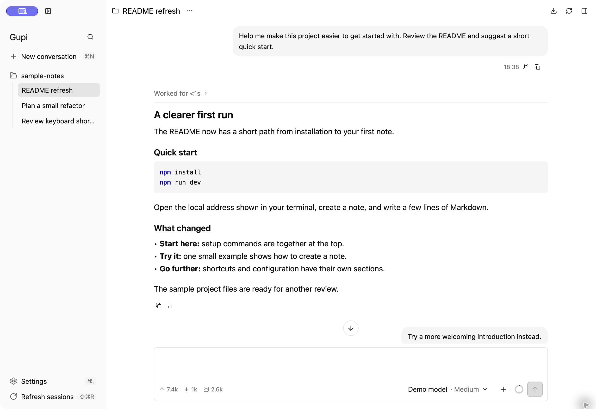
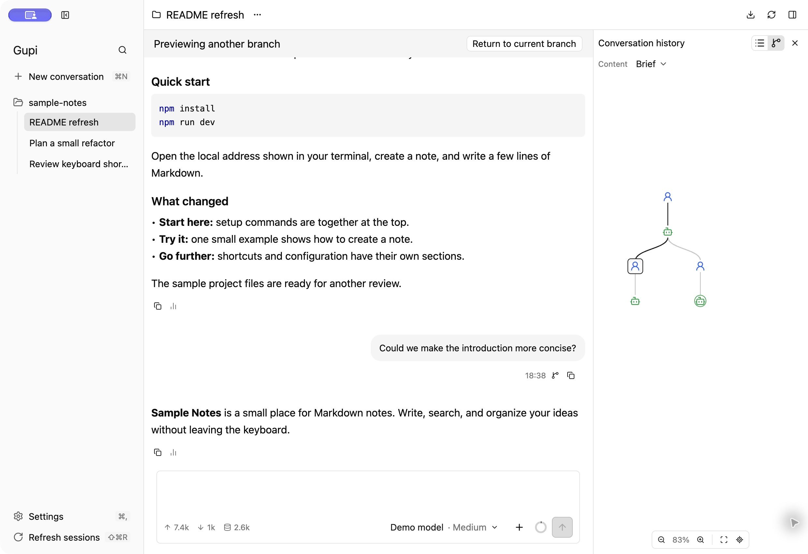
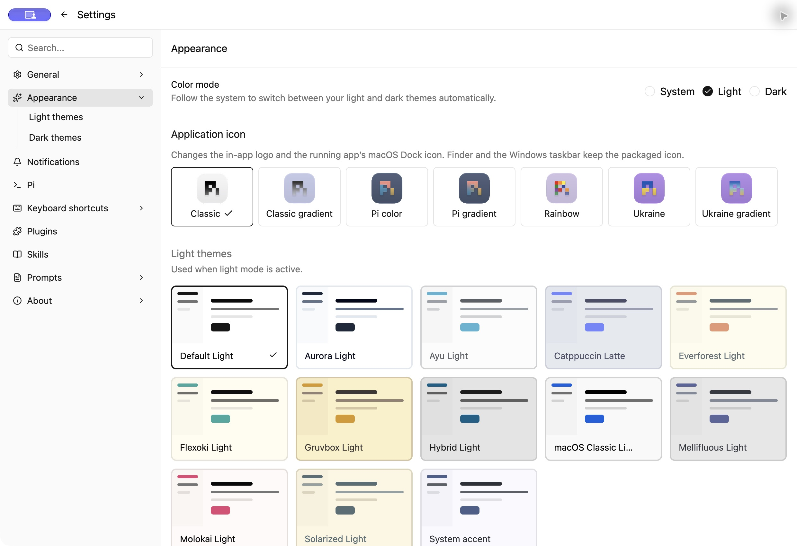

# Gupi

[English](README.md) · [简体中文](README.zh-CN.md)

**A native desktop workspace for [Pi](https://github.com/earendil-works/pi).** Organize project conversations, follow model and tool activity, explore history branches, and use temporary chats for quick tasks. Built with [GPUI Kit](https://github.com/longbridge/gpui-kit).



*Actual macOS interface, using an isolated example project and demonstration conversation.*

[Quick Start](#quick-start) · [Installation](#installation) · [Usage](#usage) · [Shortcuts and settings](#shortcuts-and-settings) · [FAQ](#faq)

## Quick Start

1. Set up your local **Pi** installation and [build environment](#installation). Confirm `pi --version` works in a terminal and configure your model account in Pi.
2. Get the source and launch Gupi:

   ```sh
   git clone https://github.com/suxiaoshao/gupi.git
   cd gupi
   cargo run -p gupi --locked
   ```

3. Choose your language and appearance in the welcome flow. Let Gupi find Pi automatically, or enter its executable's absolute path. You can also configure this later in **Settings → Pi**.
4. Choose **New conversation** and select a project folder. Once connected, choose a model below the composer, write a request, and press **Enter**.

For a first task, try: `Read this project's README and explain what it does and how to run it.`

## Installation

**Run from source or install a package you build locally.** Public releases, Homebrew, and WinGet distribution are not available yet; local packaging produces DMG/ZIP on macOS.

### Prepare Pi

Gupi uses your existing Pi executable, model accounts, and session files. It does not bundle Pi or a model subscription. With Node.js and npm installed, follow [Pi's official instructions](https://github.com/earendil-works/pi/tree/main/packages/coding-agent#readme):

```sh
npm install -g --ignore-scripts @earendil-works/pi-coding-agent
pi --version
pi
```

In Pi, use `/login` for a supported subscription, or follow its [provider setup](https://github.com/earendil-works/pi/blob/main/packages/coding-agent/docs/providers.md) for API credentials. Select a model with `/model`. Gupi's current integration baseline is **Pi 0.99.1**.

On Windows, also configure your command environment using Pi's [Windows instructions](https://github.com/earendil-works/pi/blob/main/packages/coding-agent/docs/windows.md). If you use a Node.js version manager, make sure the process launching Gupi can find both Pi and Node.js.

### Platform requirements

Install Git and [Rustup](https://rustup.rs/). The repository's [rust-toolchain.toml](rust-toolchain.toml) selects the required Rust version. Prepare your platform's dependencies below, then run the commands in Quick Start above.

<details>
<summary>macOS · Apple silicon and Intel</summary>

Use full Xcode and select its developer directory:

```sh
sudo xcode-select --switch /Applications/Xcode.app/Contents/Developer
xcrun metal --version
```

If the Metal compiler is missing, run `xcodebuild -downloadComponent MetalToolchain`.

</details>

<details>
<summary>Windows · x64</summary>

Install Visual Studio Build Tools with **Desktop development with C++**, including the Windows SDK. Use the Rust **MSVC** toolchain and run build commands in a developer PowerShell or command prompt.

</details>

<details>
<summary>Linux · x64 Debian/Ubuntu</summary>

Ubuntu 22.04 dependencies match the repository's [setup action](.github/actions/setup/action.yml):

```sh
sudo apt-get update
sudo apt-get install --no-install-recommends -y \
  build-essential pkg-config clang dpkg-dev binutils \
  libwayland-dev libxkbcommon-dev libxkbcommon-x11-dev \
  libegl1-mesa-dev libvulkan-dev libfontconfig1-dev libfreetype6-dev \
  libxcb1-dev libx11-dev libxcursor-dev libxi-dev libxrandr-dev libgbm-dev
```

Run Gupi in a graphical desktop session. Other distributions need the corresponding system libraries.

</details>

<details>
<summary>Optional: Nix development environment on macOS / Linux</summary>

The repository provides `nix develop`; inside the shell, run `cargo run -p gupi --locked`. macOS still requires full Xcode and Metal tools.

</details>

### Local application packages

Build a package locally if you prefer launching an installed app to using `cargo run`:

| Platform | Package location | Installation |
| --- | --- | --- |
| macOS Apple silicon | `dist/aarch64-apple-darwin/*.{dmg,zip}` | Open the DMG and drag `Gupi.app` to Applications, or extract the ZIP. |
| macOS Intel | `dist/x86_64-apple-darwin/*.{dmg,zip}` | Open the DMG and drag `Gupi.app` to Applications, or extract the ZIP. |
| Windows x64 | `dist/x86_64-pc-windows-msvc/*.msi` | Open the MSI for your preferred installer language. |
| Linux x64 | `dist/x86_64-unknown-linux-gnu/*.deb` | Run `sudo apt install ./dist/x86_64-unknown-linux-gnu/*.deb`. |

<details>
<summary>Show local packaging commands</summary>

On macOS/Linux, leave any Nix shell first. Use native Rustup and system libraries, with a separate build directory:

```sh
# macOS
CARGO_TARGET_DIR=target/native MACOSX_DEPLOYMENT_TARGET=11.0 \
  cargo run -p xtask --locked -- bundle

# Linux
CARGO_TARGET_DIR=target/native cargo run -p xtask --locked -- bundle
```

On Windows:

```powershell
cargo run -p xtask --locked -- bundle
```

</details>

Local macOS packages default to development ad-hoc signing and are not notarized; downloaded development packages remain subject to Gatekeeper checks. Windows and Linux packages are currently unsigned. See [Release packaging](docs/releasing.md) for formal signing and target options.

## Usage

### Projects and sessions

The sidebar groups conversations by project. Open a session to resume it, or press **Cmd/Ctrl+P** to search. Each session keeps its own draft. Use **Refresh sessions** to discover sessions created or changed in terminal Pi.

The folder selected when creating a session becomes Pi's working directory and cannot be changed later. Session menus provide rename, reveal paths, stop generation, end the running connection, and move to Trash.

### Messages and attachments

| Action | How |
| --- | --- |
| Send a message | **Enter** |
| Add a line break | **Shift+Enter** |
| Steer a running response | Write another message and press **Enter**. Pi applies its steering behavior. |
| Queue a follow-up | **Alt+Enter** |
| Stop generation | Use Stop or **Esc** after closing any active popup. |
| Reference a file or folder | Type `@` to search the current project, or choose a file/folder from the attachment menu. |
| Add an image | Use the attachment menu, paste an image, or drag it into the composer. |
| Use a skill or prompt | Open the command palette, select the resource, then finish your message. Selection does not send it. |

File references appear as path tokens inside the message. Images appear as separate attachments; click a thumbnail for a larger preview. Image support and limits depend on the selected Pi model.

When sending fails, Gupi keeps the draft and attachments for you to retry. Queued messages follow Pi's queue behavior.

### Models, responses, and tools

Responses render as Markdown with code blocks, lists, and tables. Expand a process section to inspect thinking and tool calls, or open tool details to read and copy their content. Click a local file resource to open it with the system's default application.

Use **Cmd/Ctrl+F** to find text in the conversation you are viewing. Token totals and the context indicator below the composer open usage details. The model control also lets you change the thinking level when the selected model supports it.

Extensions can ask you to select an option, confirm an action, enter a line of text, or edit longer text. Answer in the conversation's input area. Gupi also displays extension notifications, status text, and text widgets; custom terminal interfaces are not supported.

### History and branches

Open **Conversation history** in the title bar, or press **Cmd/Ctrl+Alt+B**.



- Switch between **tree** and **list**, then choose the amount of detail: Brief, Detailed, or All records.
- Select a node to preview that branch. Previewing keeps your draft and the real execution position; ordinary sending is paused while you view another branch.
- Use **Fork** on a user message to open a new session from before that question. Pi puts the question back in the new composer so you can revise it.
- Return to the actual execution position to continue the original session.

In the tree, drag or scroll to pan, pinch or hold Cmd/Ctrl while scrolling to zoom, and use the toolbar to fit the tree or locate the current node. Click a collapsed connection to expand its records.

To reuse the whole session, choose **Duplicate conversation** from its menu. To save a readable copy, choose **Export conversation as HTML** and select a destination. Both require an idle, connected session; cloning also requires existing history. HTML exports contain conversation content, so review them before sharing.

### Temporary conversations and quick tasks

Open **Temporary conversation** from the application or tray menu. On macOS and Windows, you can assign a global shortcut in **Settings → Keyboard shortcuts**. Linux does not currently have a global-shortcut backend.

Temporary conversations are useful for a translation, a short explanation, or another task you do not want in the project sidebar. You can keep several in the temporary window and search their titles. Hiding the window does not stop a running response.

- Use **Cmd/Ctrl+K** for actions such as copy, paste back, choose model, show the working directory, or delete the temporary conversation.
- With no message or attachment to send, **Enter** pastes the selected conversation's last complete answer back into the previously active app. In the search field or list, Enter also pastes back.
- **Cmd/Ctrl+Enter** in the search/list/actions area copies the answer and leaves the window open.
- Paste-back on macOS needs Accessibility permission. If it cannot paste, the answer stays on the clipboard for manual pasting.

Personal prompt templates can become shortcut tasks using selected text or clipboard input, with an optional model and thinking level for that task.

**Temporary conversation history is not saved.** These conversations cannot currently be converted into persistent sessions. Their workspaces may contain files generated by tools; use the session's Trash action or the cleanup control in General settings when those files are no longer needed.

### Personal packages, skills, and prompts

The **Plugins**, **Skills**, and **Prompts** settings pages manage your personal Pi resources:

- Install a package from a known source, update it, or remove it through Pi.
- Search and enable/disable resources.
- Register a local skill, or edit a skill/prompt you own.
- Edit personal `SYSTEM.md` and `APPEND_SYSTEM.md` instructions.

Package-owned and externally registered content is read-only. Gupi does not provide a package marketplace or a project-level configuration editor. Personal resources come from `PI_CODING_AGENT_DIR` (normally `~/.pi/agent`) and personal `~/.agents/skills`.

After an external change, refresh the resource page; refresh/reconnect an existing session when it needs to load changed resources.

## Shortcuts and settings

### Common shortcuts

**Cmd/Ctrl+Shift+P** opens the command palette. Search by the action's label or Pi command name, such as `model`, `thinking`, `tree`, `fork`, `export`, `clone`, or `compact`. Compaction asks Pi to summarize the current context; its progress and any errors appear in the session.

| Default shortcut | Action |
| --- | --- |
| Cmd/Ctrl+N | New conversation |
| Cmd/Ctrl+P | Search conversations |
| Cmd/Ctrl+Shift+P | Command palette |
| Cmd/Ctrl+F | Find conversation text |
| Cmd/Ctrl+L | Focus the composer |
| Cmd/Ctrl+Alt+/ | Model and thinking |
| Cmd/Ctrl+Alt+B | Conversation history |
| Cmd/Ctrl+B | Show/hide the session sidebar |
| Cmd/Ctrl+R | Reconnect the current session |
| Cmd/Ctrl+Shift+R | Refresh the session catalog |
| Cmd/Ctrl+, | Settings |

Here **Cmd** is used on macOS and **Ctrl** on Windows/Linux. Customize bindings in **Settings → Keyboard shortcuts**. Menu items and button hints display the current bindings.

### Appearance, language, and notifications



Use **Settings → Appearance** for system/light/dark appearance, separate light and dark theme choices, and icon styles. The interface supports English, Simplified Chinese, Traditional Chinese, Japanese, Korean, German, French, Spanish, and Brazilian Portuguese, with seven icon styles. Language and appearance changes apply immediately. macOS native dialogs use the selected language after restarting Gupi; Windows native dialogs follow the Windows display language.

**Settings → Notifications** controls waiting-for-input, failure, completion, and plugin notifications. By default, completed answers notify you while the app is in the background. The session sidebar shows unread answers and waiting/error states; clicking a notification returns to its source without answering a question for you.

macOS system notifications require an application bundle and system permission. Focus settings may affect delivery. Global shortcut support is limited to macOS/Windows, and automatic paste-back may require platform permissions.

### Updates

Choose **Gupi → Check for updates…**, or open **Settings → About → Updates**. Gupi checks stable GitHub Releases and links to the matching release notes and downloads. Packaged builds check automatically after startup and once per hour; you can turn this off in About. Source builds default to manual checks.

On macOS and Windows, choose **Download and install…** when a new version is available, then follow the update window. Use **Show update progress…** to bring that window back. Before installation, Gupi saves drafts, closes Pi connections, and restarts into the new version. Downloads begin only when you choose. Skipping a version stops automatic reminders for that version; you can still check and install it manually.

While settings are being saved, **Download and install…** is disabled. Settings changes are disabled while the update window is open and become available again when it closes and any pending save finishes.

If the install button is unavailable, use the release page or your original package manager. Development macOS packages use manual downloads; Linux updates use the system package manager. Checking for updates does not interrupt Pi or change its version, extensions, or sessions.

## FAQ

| Symptom | What to check |
| --- | --- |
| Pi cannot be found | Run `pi --version` in your terminal. Set the executable's absolute path in **Settings → Pi**, check it, and reconnect the session. |
| Pi works in a terminal but not from the Dock | Use **Check Pi** to refresh command discovery. Gupi reads the login shell's `PATH` on macOS; other required environment variables must also be available, or launch Gupi from your configured terminal. |
| Windows cannot find Pi | Put Pi/Node.js on the user or system `PATH`, or launch Gupi from a terminal with the correct environment. Gupi does not load PowerShell profiles itself. |
| The executable check passes, but a model request fails | Verify the provider login, selected model, and credentials in Pi. Read the error in the affected conversation. |
| Build fails on macOS | Verify that full Xcode is selected and `xcrun metal --version` succeeds. |
| Notifications do not appear on macOS | Use an application bundle and enable notifications in macOS settings; Focus can also suppress delivery. |

**Check Pi** verifies the executable version, not your model account; Pi manages accounts, credentials, and model requests. Graphical management of project-level Pi configuration, complete message queues, and arbitrary TUI extension interfaces is not available yet.

### Data and diagnostics

| Data | Location |
| --- | --- |
| Gupi preferences | `gupi/config.toml` in the system configuration directory |
| Window layout and unsent drafts | `state.toml` and `conversations.toml` alongside the configuration |
| Pi sessions and credentials | Managed by Pi, using its configured directories |
| macOS logs | `~/Library/Logs/gupi/gupi.log` |
| Windows/Linux logs | `gupi/logs/gupi.log` in the system local-data directory |

The default configuration directory is `~/Library/Application Support/gupi` on macOS, `%APPDATA%\gupi` on Windows, and `$XDG_CONFIG_HOME/gupi` (normally `~/.config/gupi`) on Linux. `GUPI_CONFIG_DIR`, `GUPI_LOG_DIR`, and `GUPI_DATA_DIR` override Gupi's configuration, logs, and application-data directories. Relative overrides resolve from the launch working directory.

Use **Help** to open the documentation or log location and copy basic diagnostics. Diagnostics exclude conversation text, credentials, and environment variables. Review logs or exported conversations before attaching them to a [bug report](https://github.com/suxiaoshao/gupi/issues/new/choose).

## Development and feedback

- [Development index](docs/dev/README.md) — architecture and current design documents, primarily in Chinese.
- [Release packaging](docs/releasing.md) — native builds, signing, and package formats.
- [Gupi / Pi responsibilities](docs/gui-boundary.md) — application and runtime ownership.
- [Contribution conventions](AGENTS.md) — repository layout and focused validation.

The root `gupi` package is the application. Internal crates live in `crates/`; dependency versions are defined by `Cargo.toml` and `Cargo.lock`.

Report problems or suggestions through [GitHub Issues](https://github.com/suxiaoshao/gupi/issues/new/choose). See the [developer reference](docs/dev/pi-rpc-gaps.md) for the full Pi integration boundary.

## License

Gupi's source is licensed under the [MIT License](LICENSE). Its icons are derived from Pi visual assets by Earendil Inc. and contributors; the attribution, source references, and upstream MIT license are included in [Third-party notices](THIRD_PARTY_NOTICES.md) and distributed with the application. See the [icon source notes](build-assets/icon/README.md) for Gupi's adaptations. Gupi is an independent project and is not endorsed by Pi or Earendil.
