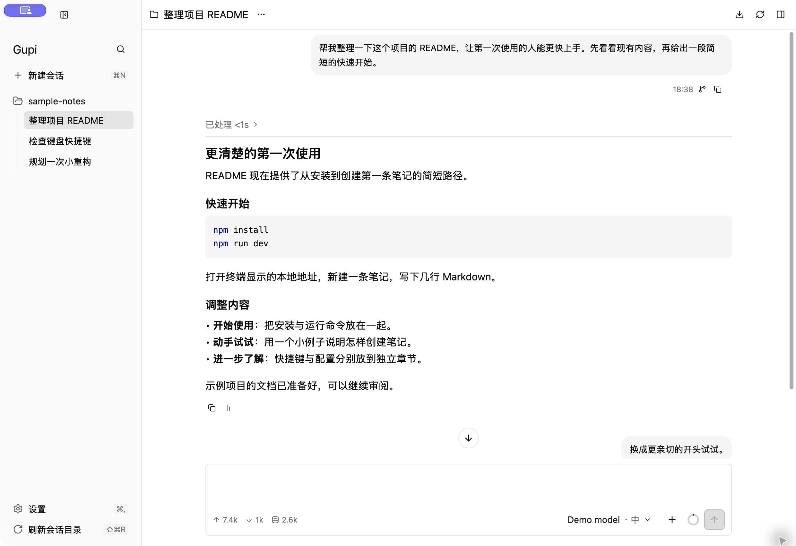
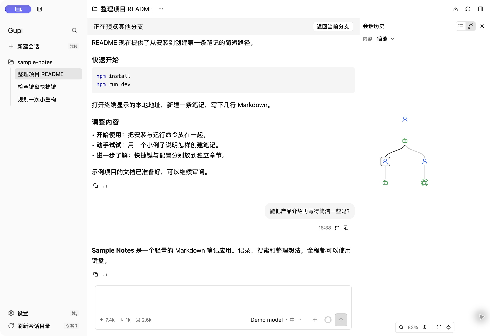
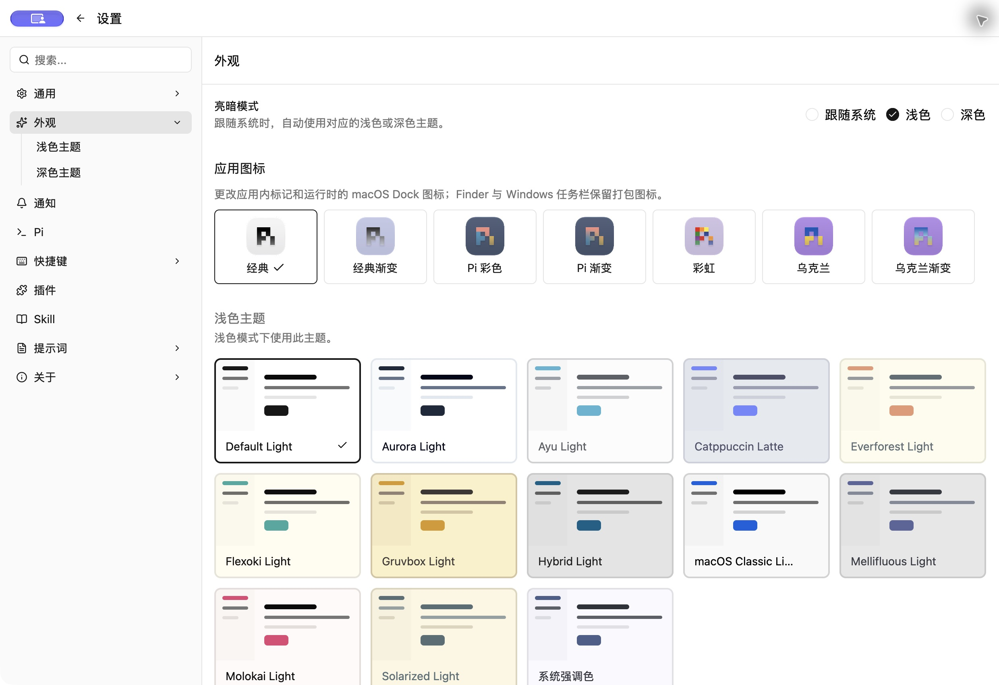

# Gupi

[English](README.md) · [简体中文](README.zh-CN.md)

**为 [Pi](https://github.com/earendil-works/pi) 提供原生桌面工作区。** 按项目整理会话，查看模型与工具的工作过程，探索历史分支，用临时对话完成随手的小任务。基于 [GPUI Kit](https://github.com/longbridge/gpui-kit) 构建。



*macOS 上的实际界面，使用隔离的示例项目和演示会话。*

[快速开始](#快速开始) · [安装](#安装) · [使用方法](#使用方法) · [快捷键与设置](#快捷键与设置) · [常见问题](#常见问题)

## 快速开始

1. [安装并配置 **Pi**](#准备-pi)。在终端确认 `pi --version` 正常，并在 Pi 中配置好模型账户。
2. [下载适合系统的 Gupi 安装包](#下载-gupi)，完成安装并启动应用。
3. 在首次引导中选择语言与外观，自动查找 Pi，或填写其可执行文件的绝对路径。也可以稍后在 **设置 → Pi** 中配置。
4. 点击 **新建会话**，选择项目文件夹。连接就绪后，在输入框下方选择模型，输入需求并按 **Enter**。

第一次可以试试：`阅读这个项目的 README，介绍它的用途和运行方式。`

## 安装

macOS 可以通过 Homebrew 安装，也可以从 [GitHub Releases](https://github.com/suxiaoshao/gupi/releases/latest) 下载预编译安装包。WinGet 待社区收录，进入公共源前请使用 Windows MSI。

### 准备 Pi

Gupi 使用已有 Pi 命令、模型账户和会话文件，不内置 Pi 或模型订阅。安装 Node.js 和 npm 后，按 [Pi 官方说明](https://github.com/earendil-works/pi/tree/main/packages/coding-agent#readme)安装：

```sh
npm install -g --ignore-scripts @earendil-works/pi-coding-agent
pi --version
pi
```

在 Pi 中使用 `/login` 登录支持的订阅，或按[提供方配置说明](https://github.com/earendil-works/pi/blob/main/packages/coding-agent/docs/providers.md)配置 API 凭据，再用 `/model` 选择模型。当前 Gupi 的接入基线为 **Pi 0.99.1**。

Windows 用户还需按 Pi 的 [Windows 说明](https://github.com/earendil-works/pi/blob/main/packages/coding-agent/docs/windows.md)配置命令环境。通过版本管理器安装 Node.js 时，请确保启动 Gupi 的进程也能找到 Pi 和 Node.js。

### Homebrew（macOS）

```sh
brew install --cask suxiaoshao/tap/gupi
```

[维护者 tap](https://github.com/suxiaoshao/homebrew-tap) 会按 Mac 架构选择已签名、公证的 DMG。Pi 仍需单独安装配置。更新或卸载：

```sh
brew update
brew upgrade --cask --greedy suxiaoshao/tap/gupi
brew uninstall --cask suxiaoshao/tap/gupi
```

Gupi 带有内置更新功能，`--greedy` 会将它的 Cask 纳入 Homebrew 升级。卸载会保留 Gupi 偏好和 Pi 数据。

### 下载 Gupi

| 平台 | 下载 v0.1.0 | 安装方法 |
| --- | --- | --- |
| macOS · Apple 芯片 | [DMG](https://github.com/suxiaoshao/gupi/releases/download/v0.1.0/Gupi_0.1.0_aarch64_macos.dmg) · [ZIP](https://github.com/suxiaoshao/gupi/releases/download/v0.1.0/Gupi_0.1.0_aarch64_macos.zip) | 打开 DMG，将 `Gupi.app` 拖到“应用程序”；也可以解压 ZIP 后将应用移入该目录。 |
| macOS · Intel | [DMG](https://github.com/suxiaoshao/gupi/releases/download/v0.1.0/Gupi_0.1.0_x86_64_macos.dmg) · [ZIP](https://github.com/suxiaoshao/gupi/releases/download/v0.1.0/Gupi_0.1.0_x86_64_macos.zip) | 打开 DMG，将 `Gupi.app` 拖到“应用程序”；也可以解压 ZIP 后将应用移入该目录。 |
| Windows · x64 | [简体中文 MSI](https://github.com/suxiaoshao/gupi/releases/download/v0.1.0/Gupi_0.1.0_x64_zh-CN.msi) · [全部安装语言](https://github.com/suxiaoshao/gupi/releases/tag/v0.1.0) | 运行 MSI 完成安装，再从开始菜单打开 Gupi。 |
| Linux · x64 Debian/Ubuntu | [deb](https://github.com/suxiaoshao/gupi/releases/download/v0.1.0/Gupi_0.1.0_amd64.deb) | 执行 `sudo apt install ./Gupi_0.1.0_amd64.deb`，然后在图形桌面会话中启动 Gupi。 |

macOS 安装包要求 macOS 11 或更高版本，已使用 Developer ID 签名并通过 Apple 公证。Windows 安装包尚未做 Authenticode 签名，系统可能显示“未知发布者”；Linux 包也未签名。Release 中提供 `SHA256SUMS`，用于校验下载文件。

<details>
<summary>从源码运行或创建本地安装包</summary>

### 构建环境

安装 Git 和 [Rustup](https://rustup.rs/)，仓库的 [rust-toolchain.toml](rust-toolchain.toml)会选择所需 Rust 版本。完成下方对应平台的依赖准备后，获取源码并运行 Gupi：

```sh
git clone https://github.com/suxiaoshao/gupi.git
cd gupi
cargo run -p gupi --locked
```

<details>
<summary>macOS · Apple 芯片与 Intel</summary>

使用完整 Xcode，并选择其开发者目录：

```sh
sudo xcode-select --switch /Applications/Xcode.app/Contents/Developer
xcrun metal --version
```

如果缺少 Metal 编译器，运行 `xcodebuild -downloadComponent MetalToolchain`。

</details>

<details>
<summary>Windows · x64</summary>

安装 Visual Studio Build Tools，选择 **使用 C++ 的桌面开发**，包含 Windows SDK。使用 Rust **MSVC** 工具链，在开发者 PowerShell 或命令提示符中运行构建命令。

</details>

<details>
<summary>Linux · x64 Debian/Ubuntu</summary>

Ubuntu 22.04 的依赖与仓库[环境配置 Action](.github/actions/setup/action.yml)保持一致：

```sh
sudo apt-get update
sudo apt-get install --no-install-recommends -y \
  build-essential pkg-config clang dpkg-dev binutils \
  libwayland-dev libxkbcommon-dev libxkbcommon-x11-dev \
  libegl1-mesa-dev libvulkan-dev libfontconfig1-dev libfreetype6-dev \
  libxcb1-dev libx11-dev libxcursor-dev libxi-dev libxrandr-dev libgbm-dev
```

在图形桌面会话中运行 Gupi。其他发行版需安装对应系统库。

</details>

<details>
<summary>可选：macOS / Linux 的 Nix 开发环境</summary>

仓库提供 `nix develop`，进入后执行 `cargo run -p gupi --locked`。macOS 仍需要完整 Xcode 与 Metal 工具。

</details>

### 本地应用安装包

不想每次通过 `cargo run` 启动时，可以在本机打包：

| 平台 | 安装包位置 | 安装方法 |
| --- | --- | --- |
| macOS Apple 芯片 | `dist/aarch64-apple-darwin/*.{dmg,zip}` | 打开 DMG，将 `Gupi.app` 拖到“应用程序”；也可以解压 ZIP。 |
| macOS Intel | `dist/x86_64-apple-darwin/*.{dmg,zip}` | 打开 DMG，将 `Gupi.app` 拖到“应用程序”；也可以解压 ZIP。 |
| Windows x64 | `dist/x86_64-pc-windows-msvc/*.msi` | 打开所需安装语言的 MSI。 |
| Linux x64 | `dist/x86_64-unknown-linux-gnu/*.deb` | 执行 `sudo apt install ./dist/x86_64-unknown-linux-gnu/*.deb`。 |

<details>
<summary>查看本地打包命令</summary>

macOS/Linux 先退出 Nix Shell，使用原生 Rustup 和系统库，并指定独立构建目录：

```sh
# macOS
CARGO_TARGET_DIR=target/native MACOSX_DEPLOYMENT_TARGET=11.0 \
  cargo run -p xtask --locked -- bundle

# Linux
CARGO_TARGET_DIR=target/native cargo run -p xtask --locked -- bundle
```

Windows：

```powershell
cargo run -p xtask --locked -- bundle
```

</details>

本地 macOS 包默认使用开发期 ad-hoc 签名，未公证；下载得到的开发包仍受 Gatekeeper 检查。Windows 和 Linux 包目前未签名。正式签名及目标架构选项见[发行指南](docs/releasing.md)。

</details>

## 使用方法

### 项目与会话

侧栏按项目整理会话。点击已有会话恢复工作，按 **Cmd/Ctrl+P** 搜索。每个会话保留独立草稿；在终端 Pi 中新增或修改了会话后，点击 **刷新会话目录** 发现变化。

新建时选择的文件夹是 Pi 的工作目录，会话创建后不能更换。会话菜单提供重命名、显示路径、停止生成、结束运行和移到废纸篓。

### 输入与附件

| 操作 | 方法 |
| --- | --- |
| 发送消息 | **Enter** |
| 换行 | **Shift+Enter** |
| 调整正在执行的任务 | 输入新消息并按 **Enter**，由 Pi 按 steer 语义处理。 |
| 排队追加后续消息 | **Alt+Enter**，提交 follow-up。 |
| 停止生成 | 点击停止，或先关闭弹层后按 **Esc**。 |
| 引用文件或文件夹 | 输入 `@` 搜索当前项目，或从附件菜单选择文件/文件夹。 |
| 添加图片 | 使用附件菜单、粘贴图片，或将图片拖到输入框中。 |
| 使用 Skill 或提示词 | 打开命令面板，选择资源后继续编辑消息；选择本身不会发送。 |

文件引用在正文中显示为路径标签。图片在附件区单独显示，点击缩略图可以查看大图。模型是否支持图片及其限制由 Pi 中选择的模型决定。

发送失败时，Gupi 会保留草稿与附件，便于重试。排队消息遵循 Pi 的队列行为。

### 模型、回答与工具

回答支持 Markdown、代码块、列表和表格。展开过程区查看思考和工具调用，打开工具详情阅读或复制内容。点击本地文件资源，可以通过系统默认应用打开。

按 **Cmd/Ctrl+F** 查找当前查看的会话正文。输入框下方的累计 Token 和上下文指示器可以打开用量详情；模型支持思考等级时，也可以在模型控件中调整。

扩展可以请求单选、确认、单行输入或多行编辑，请在对应会话的输入区域作答。Gupi 也展示扩展通知、状态文字和文本 widget，暂不支持自定义终端界面。

### 历史与分支

点击标题栏的**会话历史**，或按 **Cmd/Ctrl+Alt+B**。



- 在**树**和**列表**之间切换，选择简略、详细或全部记录。
- 选择节点预览该分支。预览会保留草稿和实际执行位置；查看其他分支时，普通发送会暂停。
- 对用户消息使用**另开会话（Fork）**，从该次提问之前创建新会话。Pi 会把问题填回新输入框，方便修改后再次提问。
- 返回实际执行位置，继续原会话。

在树中拖动或滚动可以平移，双指缩放或按住 Cmd/Ctrl 滚动可以缩放，工具栏提供查看全图和定位当前节点。点击已收起的连线，可以展开其中的记录。

需要复用整个会话时，在菜单中选择**复制会话**。需要保存可阅读的副本时，选择**导出会话为 HTML**并指定位置。两者都要求会话已连接且空闲；复制还要求已有历史。HTML 包含会话内容，分享前请先检查。

### 临时对话与快捷任务

从应用菜单或托盘打开**临时对话**。macOS 和 Windows 可以在**设置 → 快捷键**中绑定全局召唤键，Linux 暂无全局快捷键后端。

临时对话适合翻译、简短解释等不需要进入项目侧栏的小任务。窗口中可以保留多个临时会话，并按标题搜索。隐藏窗口不会停止正在生成的回答。

- 按 **Cmd/Ctrl+K** 打开操作面板，复制或回填回答、选择模型、显示工作目录或删除临时会话。
- 输入框没有待发送文字与附件时，**Enter** 会把所选会话最后的完整回答回填到之前的应用；在搜索框或会话列表中，Enter 也会回填。
- 在搜索框、列表或操作面板中按 **Cmd/Ctrl+Enter**，只复制回答并保留窗口。
- macOS 回填需要辅助功能权限。无法自动粘贴时，回答仍保留在剪贴板中，可手动粘贴。

个人提示词模板可以配置成快捷任务，使用选中文字或剪贴板内容，并为该任务指定模型与思考等级。

**临时对话不保存会话历史**，目前也不能转存为普通会话。其工作目录可能保留工具生成的文件，不再需要时，可以使用会话的废纸篓操作，或通用设置中的清理入口。

### 个人插件包、Skill 和提示词

设置中的**插件**、**Skill**和**提示词**页面管理个人 Pi 资源：

- 通过 Pi 从已知来源安装插件包、更新或移除包。
- 搜索并启用/禁用资源。
- 登记本地 Skill，或编辑自己创建的 Skill/提示词。
- 编辑个人 `SYSTEM.md` 和 `APPEND_SYSTEM.md` 指令。

包内资源及外部登记的内容只读。Gupi 当前没有插件包市场或项目级配置编辑器。个人资源来自 `PI_CODING_AGENT_DIR`（通常为 `~/.pi/agent`）和个人 `~/.agents/skills`。

外部修改后，刷新资源页面；已有会话需要加载变更时，刷新或重新连接该会话。

## 快捷键与设置

### 常用快捷键

按 **Cmd/Ctrl+Shift+P** 打开命令面板。可以搜索中文动作名或 Pi 命令名，例如 `model`、`thinking`、`tree`、`fork`、`export`、`clone`、`compact`。压缩会话会请求 Pi 整理当前上下文，进度和错误会显示在会话中。

| 默认快捷键 | 操作 |
| --- | --- |
| Cmd/Ctrl+N | 新建会话 |
| Cmd/Ctrl+P | 搜索会话 |
| Cmd/Ctrl+Shift+P | 命令面板 |
| Cmd/Ctrl+F | 查找会话正文 |
| Cmd/Ctrl+L | 聚焦输入框 |
| Cmd/Ctrl+Alt+/ | 模型与思考等级 |
| Cmd/Ctrl+Alt+B | 会话历史 |
| Cmd/Ctrl+B | 展开或收起会话侧栏 |
| Cmd/Ctrl+R | 重新连接当前会话 |
| Cmd/Ctrl+Shift+R | 刷新会话目录 |
| Cmd/Ctrl+, | 设置 |

macOS 使用 **Cmd**，Windows/Linux 使用 **Ctrl**。在**设置 → 快捷键**中可以自定义，菜单和按钮提示会显示当前绑定。

### 外观、语言与通知



在**设置 → 外观**中选择跟随系统、浅色或深色外观，分别配置浅色和深色主题，并选择图标样式。界面支持英语、简体中文、繁体中文、日语、韩语、德语、法语、西班牙语和巴西葡萄牙语，并提供七种图标样式。语言与外观即时生效。macOS 原生对话框在重启 Gupi 后使用所选语言；Windows 原生对话框跟随系统显示语言。

**设置 → 通知**可以配置等待输入、失败、回答完成及插件通知。默认在应用处于后台时通知回答完成。侧栏显示未读、待答和错误状态；点击通知只会返回来源会话，不会代你回答问题。

macOS 系统通知需要应用 bundle 和系统授权，专注模式可能影响投递。全局快捷键仅支持 macOS/Windows，自动回填也可能需要平台权限。

### 更新

选择 **Gupi → 检查更新…**，或打开**设置 → 关于 → 更新**。Gupi 检查 GitHub 上的正式版本，并提供对应的更新说明与下载页。发行包在启动后及每小时自动检查一次，可在「关于」中关闭；源码运行默认仅手动检查。

macOS 和 Windows 发现新版后，可选择**下载并安装…**，并在更新窗口中继续。可通过**查看更新进度…**重新打开该窗口。安装前，Gupi 会保存草稿、关闭 Pi 连接，并重新启动新版。下载由你主动开始。跳过某个版本后，不再自动提醒该版本，仍可手动检查并安装。

保存设置时，**下载并安装…**暂不可用。更新窗口打开期间暂停设置修改，窗口关闭且进行中的保存完成后恢复。

如果没有安装按钮，请使用发行页面或原来的包管理器。macOS 开发包通过手动下载更新，Linux 通过系统包管理器更新。检查更新不会中断 Pi，也不会改变 Pi 的版本、扩展或会话。

## 常见问题

| 现象 | 检查方法 |
| --- | --- |
| 找不到 Pi | 在终端运行 `pi --version`。在**设置 → Pi**填写可执行文件的绝对路径，检测后重新连接会话。 |
| 终端中可用，从 Dock 启动后不可用 | 使用**检测 Pi**刷新命令查找。macOS 会读取登录 Shell 的 `PATH`；其他必需环境变量也需要能被应用读取，或从已配置的终端启动 Gupi。 |
| Windows 找不到 Pi | 将 Pi/Node.js 加入用户或系统 `PATH`，或从环境正确的终端启动。Gupi 不会自行加载 PowerShell profile。 |
| 版本检测通过，但模型请求失败 | 在 Pi 中确认提供方登录、模型及凭据，查看对应会话中的错误。 |
| macOS 构建失败 | 确认已选择完整 Xcode，并且 `xcrun metal --version` 成功。 |
| macOS 没有通知 | 使用应用 bundle，在系统设置中允许通知；专注模式也可能影响显示。 |

**检测 Pi** 只验证可执行文件版本，不验证模型账户；账户、凭据与模型请求仍由 Pi 管理。项目级 Pi 配置、完整队列管理和任意 TUI 扩展界面尚未提供对应的图形管理能力。

### 数据与诊断

| 数据 | 位置 |
| --- | --- |
| Gupi 偏好 | 系统配置目录下的 `gupi/config.toml` |
| 窗口布局与未发送草稿 | 配置旁的 `state.toml`、`conversations.toml` |
| Pi 会话与凭据 | 由 Pi 按其配置目录管理 |
| macOS 日志 | `~/Library/Logs/gupi/gupi.log` |
| Windows/Linux 日志 | 系统本地数据目录下的 `gupi/logs/gupi.log` |

默认配置目录：macOS 为 `~/Library/Application Support/gupi`，Windows 为 `%APPDATA%\gupi`，Linux 为 `$XDG_CONFIG_HOME/gupi`（通常是 `~/.config/gupi`）。`GUPI_CONFIG_DIR`、`GUPI_LOG_DIR`、`GUPI_DATA_DIR` 分别覆盖 Gupi 的配置、日志和应用数据目录。相对路径以启动工作目录为基准。

**帮助**菜单可以打开文档和日志位置，复制基础诊断信息。基础诊断不含会话正文、凭据或环境变量。向[问题反馈](https://github.com/suxiaoshao/gupi/issues/new/choose)附加日志或导出会话前，请先检查内容。

## 开发与反馈

- [开发索引](docs/dev/README.md)：架构及当前设计文档，主要使用中文。
- [发行与打包](docs/releasing.md)：原生构建、签名及产物格式。
- [Gupi 与 Pi 的职责边界](docs/gui-boundary.md)：应用与运行时的职责划分。
- [贡献约定](AGENTS.md)：仓库结构与必要验证。

根 `gupi` 包是应用入口，内部 crate 位于 `crates/`，依赖版本以 `Cargo.toml` 和 `Cargo.lock` 为准。

问题或建议请提交到 [GitHub Issues](https://github.com/suxiaoshao/gupi/issues/new/choose)。完整 Pi 接入范围见[开发参考](docs/dev/pi-rpc-gaps.md)。

## 许可

Gupi 源码采用 [MIT License](LICENSE)。应用图标派生自 Earendil Inc. and contributors 的 Pi 视觉资源；署名、来源与上游 MIT 许可原文收录于[第三方声明](THIRD_PARTY_NOTICES.md)，并随应用分发。Gupi 的具体改动见[图标来源记录](build-assets/icon/README.md)。Gupi 是独立项目，不代表 Pi 或 Earendil 的官方背书。
